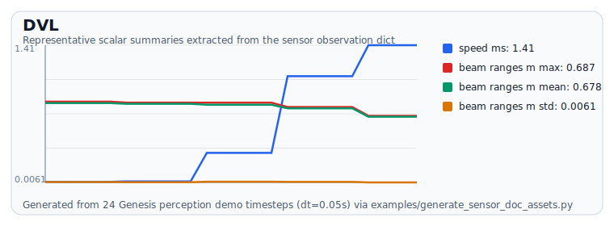
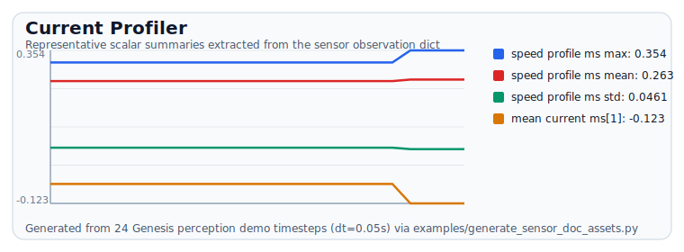

# DVL & Current Profiler

## Example output

> Generated from `examples/generate_sensor_doc_assets.py` using `make_synthetic_sensor_state()`.

### DVL example plot

### Current profiler example plot

::: genesis_sensors._runtime_sensors.acoustic_navigation
    options:
      show_root_heading: true
      show_source: false
      members_order: source
      show_category_heading: true
      merge_init_into_class: true
