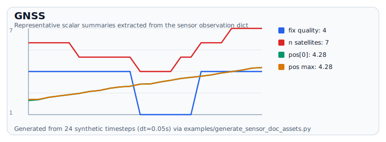

# GNSS / GPS

## Example output

> Generated from `examples/generate_sensor_doc_assets.py` using `make_synthetic_sensor_state()`.

### GNSS example plot

::: genesis_sensors._runtime_sensors.gnss
    options:
      show_root_heading: true
      show_source: false
      members_order: source
      show_category_heading: true
      merge_init_into_class: true
