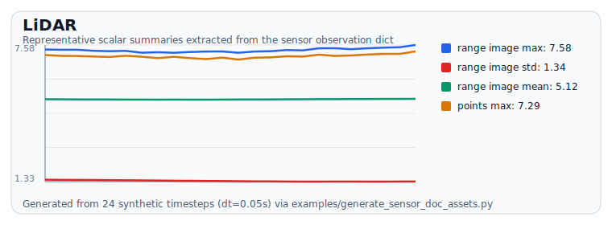
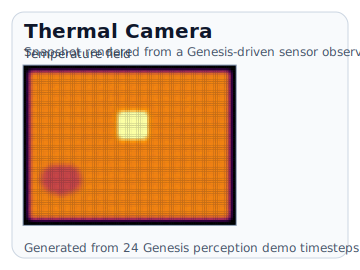
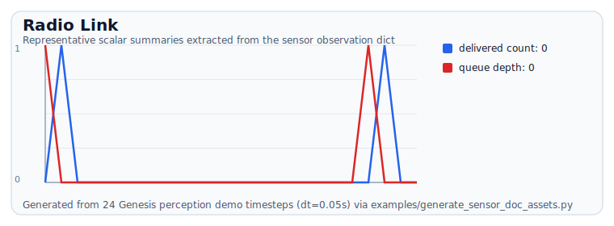
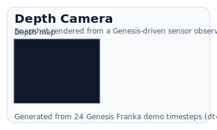

# Genesis World Examples

These are end-to-end examples using **`genesis-world`** (`import genesis as gs`) together with
**`genesis_sensors`**. The plots and snapshots shown below are generated from the same
Genesis-backed demo scenes used by the documentation asset pipeline.

---

## Drone perception stack

Run the standalone example:

```bash
PYTHONPATH=src python examples/perception_demo.py --steps 12 --dt 0.02
```

Minimal integration pattern:

```python
import genesis as gs
from genesis_sensors.scenes import build_perception_demo

demo = build_perception_demo(dt=0.02, show_viewer=False, use_gpu=False, seed=0)
demo.rig.reset()

for step in range(12):
    if demo.controller is not None:
        demo.controller(step)
    demo.scene.step()
    obs = demo.rig.step(step * 0.02)

print(obs["rgb"]["rgb"].shape)                 # (72, 96, 3)
print(len(obs["lidar"]["points"]))            # ~500 points
print(float(obs["thermal"]["temperature_c"].max()))
```

Verified console output:

```text
perception rig: rgb, events, thermal, lidar, gnss, radio, uwb, radar, imu, barometer, magnetometer, thermometer, hygrometer, light_sensor, gas_sensor, anemometer, airspeed, rangefinder, ultrasonic, imaging_sonar, side_scan, dvl, current_profiler, optical_flow, battery, stereo, wheel_odometry
step=000 rgb_mean= 138.0 lidar_points= 500 thermal_peak= 60.8C radio_delivered=0
step=002 rgb_mean= 132.2 lidar_points= 500 thermal_peak= 60.4C radio_delivered=0
step=004 rgb_mean= 128.6 lidar_points= 500 thermal_peak= 59.4C radio_delivered=0
step=006 rgb_mean= 126.0 lidar_points= 504 thermal_peak= 57.7C radio_delivered=0
step=008 rgb_mean= 124.3 lidar_points= 504 thermal_peak= 55.6C radio_delivered=0
step=010 rgb_mean= 123.2 lidar_points= 502 thermal_peak= 53.0C radio_delivered=0
```

<div class="generated-example-grid">
  <figure class="generated-example">
    
    <figcaption>RGB camera output from the Genesis perception demo.</figcaption>
  </figure>
  <figure class="generated-example">
    
    <figcaption>LiDAR range image and point cloud generated from the same scene.</figcaption>
  </figure>
  <figure class="generated-example">
    
    <figcaption>Thermal sensor output produced by the runtime model.</figcaption>
  </figure>
  <figure class="generated-example">
    
    <figcaption>Telemetry-link quality emitted while the Genesis demo is running.</figcaption>
  </figure>
</div>

---

## Franka wrist + proprioception

Run the manipulation example:

```bash
PYTHONPATH=src python examples/franka_demo.py --steps 12 --dt 0.02
```

```python
import numpy as np
from genesis_sensors.scenes import build_franka_demo

demo = build_franka_demo(dt=0.02, show_viewer=False, use_gpu=False, seed=0)
demo.rig.reset()

for step in range(12):
    if demo.controller is not None:
        demo.controller(step)
    demo.scene.step()
    obs = demo.rig.step(step * 0.02)

q = np.asarray(obs["joint_state"]["joint_pos_rad"], dtype=float)[:3]
force = np.asarray(obs["force_torque"]["force_n"], dtype=float)
print(q.round(3).tolist(), force.round(3).tolist())
```

Verified console output:

```text
franka rig: imu, force_torque, joint_state, contact, depth_camera, tactile_array, current, rpm
step=000 q=[-0.0, 0.002, 0.005] force=[-0.006, -0.015, 0.048] tactile=0.0063
step=002 q=[0.002, 0.014, 0.027] force=[-0.016, 0.031, -0.008] tactile=0.0015
step=004 q=[0.005, 0.037, 0.046] force=[-0.02, -0.07, -0.018] tactile=0.0079
step=006 q=[0.01, 0.071, 0.06] force=[-0.037, 0.02, 0.004] tactile=0.0107
step=008 q=[0.015, 0.115, 0.071] force=[0.002, -0.008, -0.034] tactile=0.0053
step=010 q=[0.021, 0.171, 0.079] force=[0.07, 0.063, -0.055] tactile=0.0080
```

<div class="generated-example-grid">
  <figure class="generated-example">
    
    <figcaption>Depth-camera output captured from the Genesis Franka setup.</figcaption>
  </figure>
  <figure class="generated-example">
    
    <figcaption>Wrist force/torque traces from the manipulation rig.</figcaption>
  </figure>
  <figure class="generated-example">
    
    <figcaption>Tactile taxel response generated by the same runtime model.</figcaption>
  </figure>
  <figure class="generated-example">
    
    <figcaption>Current-monitor output tied to the robot motion in the demo scene.</figcaption>
  </figure>
</div>

---

## Use the rig factories in your own `gs.Scene`

If you already have a Genesis scene, attach a sensor rig directly:

```python
import genesis as gs
from genesis_sensors import make_drone_perception_rig

gs.init(backend=gs.cpu, logging_level="warning")
scene = gs.Scene(show_viewer=False)
scene.add_entity(gs.morphs.Plane())
drone = scene.add_entity(gs.morphs.Drone(file="urdf/drones/cf2x.urdf", pos=(0.0, 0.0, 0.7)))
scene.build()

rig = make_drone_perception_rig(drone, dt=0.02, seed=0)
rig.reset()

for step in range(12):
    scene.step()
    obs = rig.step(step * 0.02)
    print(obs["gnss"], len(obs["lidar"]["points"]))
```

> The rest of the documentation reuses this same Genesis-backed flow: the generated example
> panels in `sensor-models.md` and the API reference are rendered from live demo-scene outputs,
> not hand-drawn placeholders.
